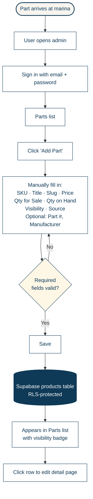

# Add a Part — Phase 2.1 (Current State)

**Phase:** 2.1 — shipped May 18, 2026  
**Flow type:** Admin / user task flow  
**Project:** Ess-Kay Yards Marina e-commerce platform

---

## Diagram

---

## What this captures

The minimum viable inventory entry flow as shipped in Phase 2.1. The user signs in, navigates to Parts, clicks Add Part, fills in fields manually, and saves to a Supabase database with row-level security. The part appears in the Parts list with a visibility badge (Public / Internal / eBay Only).

## Workflow time

Approximately 3 minutes per part. Every field is typed manually.

## Known friction (drives Phase 2.2)

- Every field is entered manually, including frequently-repeated values like Manufacturer.
- No detection of duplicate part numbers — users can accidentally create multiple disconnected listings for the same physical part.
- The detail page shows only the individual item, with no context of related listings or sale history.

---

## Visual key

- **Cream rounded** = offline / real-world events
- **White rectangle** = user actions in the app
- **Yellow diamond** = decision points
- **Navy cylinder** = data store
