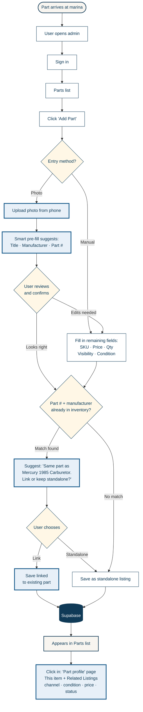

# Add a Part — Phase 2.2 (Evolution)

**Phase:** 2.2 — planned  
**Flow type:** Admin / user task flow  
**Project:** Ess-Kay Yards Marina e-commerce platform  
**Evolves from:** `01-add-part-flow-phase-2-1.md`

---

## Diagram

---

## What changed and why

Phase 2.1 worked but had real workflow friction. Users had to manually re-type the same part numbers each time duplicate inventory arrived (constant with obsolete marine parts), and there was no way to see "we've had three of these before — here's what we sold them for."

Phase 2.2 adds three deliberate evolutions.

### 1. Photo-first entry path

The user takes a photo on their phone. The system suggests title, manufacturer, and part number based on the image. They confirm or edit.

**Impact:** Time-to-add drops from ~3 minutes to ~30 seconds per part.

**Language note:** Presented to users as "smart pre-fill," never as "AI" or "automation." Change-averse users stay confident in the tool.

### 2. Match detection at upload time

When the part number matches an existing part already in inventory, the system surfaces a soft prompt: *"Same part as Mercury 1985 Carburetor — link or keep standalone?"*

**Impact:** Solves the data-quality problem from Phase 2.1 (typos breaking grouping) and gives the user explicit control over public-facing structure.

### 3. "Part profile" detail page

Clicking any part now shows that item plus a Related Listings section — every other instance of the same part with channel (website / eBay / in-store), condition, price, and status.

**Impact:**
- **For staff:** single source of truth for inventory across channels.
- **For customers:** provenance and pricing context for obsolete parts.

---

## The unlock

**The source-of-truth admin view is always linked; the public-facing display is configurable per item.**

Internal staff never lose the relationship between identical parts. Customers see whatever curation the user chose — link to an existing listing for a unified product page, or keep standalone for a fresh listing.

---

## Visual key

- **Cream rounded** = offline / real-world events
- **White rectangle** = user actions in the app (existed in Phase 2.1)
- **Light blue with thick border** = NEW in Phase 2.2
- **Yellow diamond** = decision points
- **Navy cylinder** = data store
