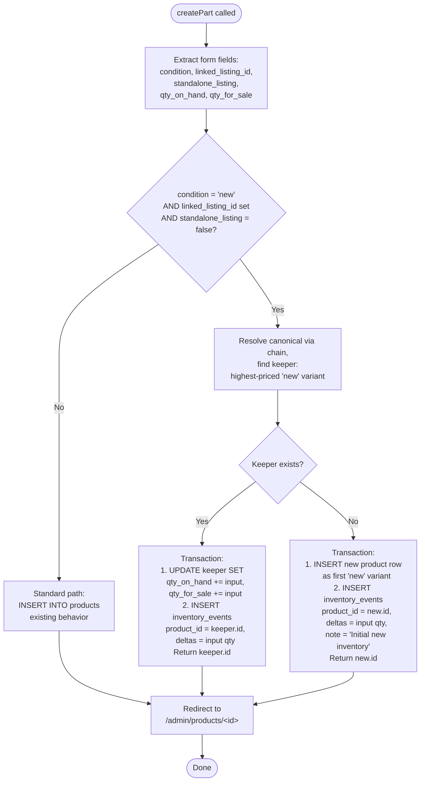

# Consolidate-on-Add — Server Flow

**Flow type:** Server action / data mutation  
**Last updated:** June 1, 2026  
**Status:** Planned (not yet built)

> **Diagram key:** White nodes = shipped. Light blue nodes with thick border = planned (not yet built).

---

## Diagram

