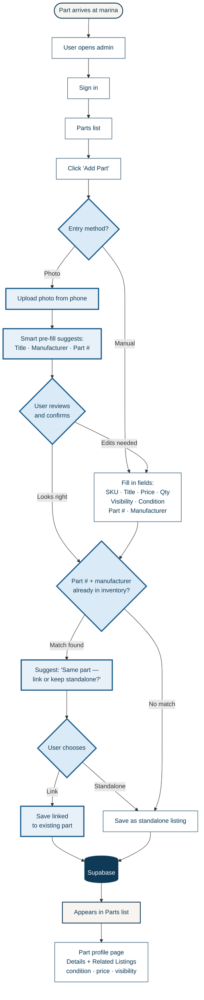

# Add a Part — current state

**Flow type:** Admin / user task flow  
**Last updated:** June 1, 2026  
**Shipped through:** Phase 2.1 + Part profile page (Phase 2.2 deliverable #3)

> **Diagram key:** White nodes = shipped. Light blue nodes with thick border = planned (not yet built).

---

## Diagram

---

## What's shipped

| Node | Status | Phase |
|---|---|---|
| Sign in → Parts list | ✅ Shipped | 2.1 |
| Add Part (manual form) | ✅ Shipped | 2.1 |
| Condition field on form | ✅ Shipped | 2.2 |
| Save → appears in Parts list | ✅ Shipped | 2.1 |
| Part profile page + Related Listings | ✅ Shipped | 2.2 |
| Photo upload + smart pre-fill | 🔄 Planned | 2.2 |
| Match detection at upload | 🔄 Planned | 2.2 |
| Link / standalone choice | 🔄 Planned | 2.2 |

## Current path (no planned nodes)

For the current shipped state, the effective flow is:

**Start → Sign in → Parts list → Add Part → Manual form → Save → Parts list → Click row → Part profile page**

Match detection and the photo path are the two remaining Phase 2.2 deliverables.

---

## Visual key

- **Cream rounded** = offline / real-world events
- **White rectangle** = user actions in the app (shipped)
- **Light blue with thick border** = planned / not yet built
- **Yellow diamond** = shipped decision points
- **Blue diamond with thick border** = planned decision points
- **Navy cylinder** = data store
